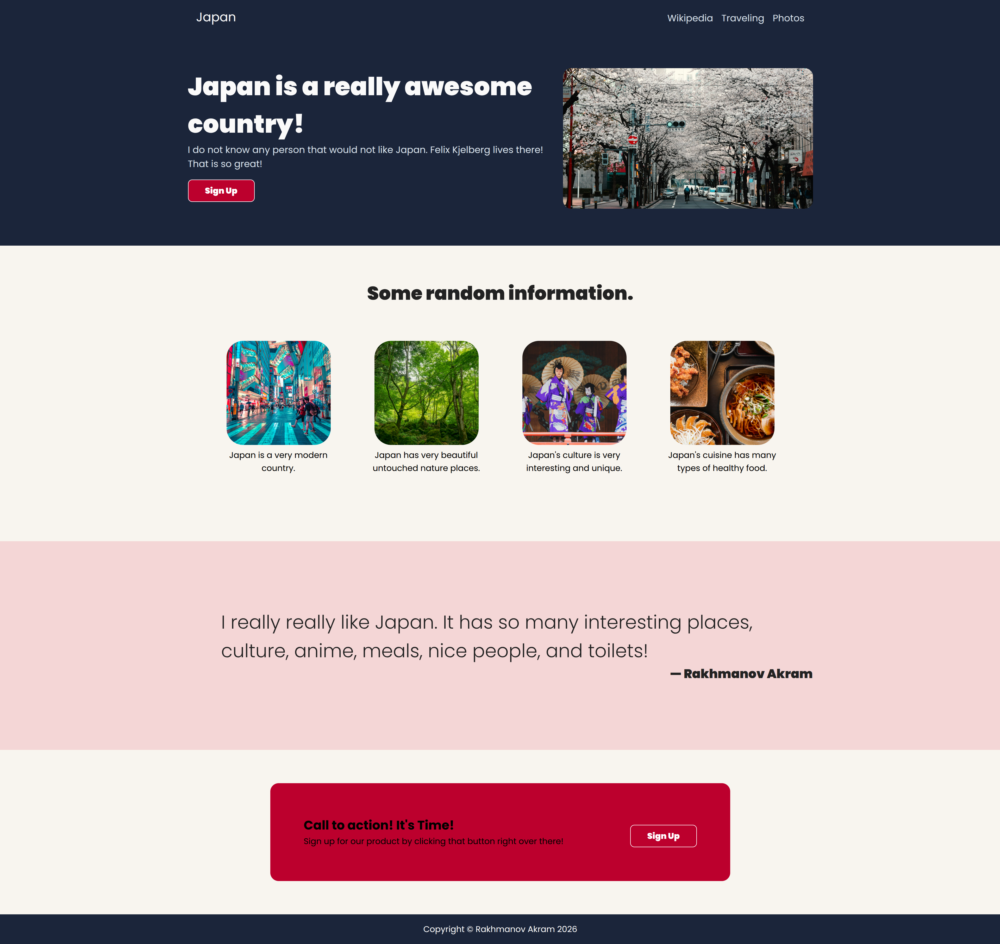

# Odin Landing Page of Japan by Akram
A practical page to show off my skills at my current progress on TheOdinProject course (and my love for Japan).

The design was taken from the tutorial, but changed a little bit by me.

## Preview

## What I learned:
- Building layouts with flexbox
- Creating reusable HTML structures
- Using containers and sections for page architecture
- Organizing CSS styles

## Technologies
- HTML5
- CSS3
- Flexbox

## Photos:

- Main photo of Kyoto city by Agathe (unsplash)
https://unsplash.com/photos/person-riding-bike-on-street-2cdvYh6ULCs

- Nature photo by Aaron Katz (unsplash)
https://unsplash.com/photos/green-trees-on-brown-soil-NWleDEFmYDg

- Japanese women in kimono by Susann Schuster (unsplash)
https://unsplash.com/photos/woman-in-kimono-standing-on-wooden-bridge-C_ULRNO8q0w

- Japan meals photo by Paulo Doi (unsplash)
https://unsplash.com/photos/pasta-dish-in-stainless-steel-bowl-6uTQmtqcAzs

- Japan Tokyo photo by Jezael Melgoza (unsplash)
https://unsplash.com/photos/people-walking-on-road-near-well-lit-buildings-layMbSJ3YOE